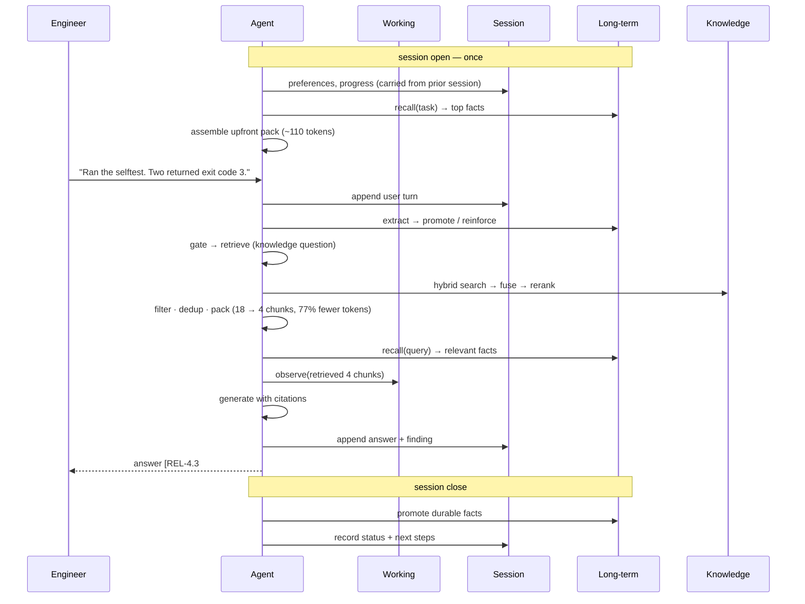

# Architecture

## Memory tiers and the retrieval pipeline

```mermaid
flowchart TB
    U[Engineer] --> T{JIT gate}

    subgraph UP["UPFRONT — once per session, ~110 tokens"]
        P[Preferences<br/>user-scoped]
        TP[Task progress<br/>carried across sessions]
        EF[Top episodic facts<br/>semantic recall]
        SM[Last compaction summary]
    end

    UP -.loaded before turn 1.-> CTX

    T -->|skip: ack · memory-only<br/>fragment · profile statement| MEM[Answer from memory tiers]
    T -->|retrieve| R

    subgraph R["JUST-IN-TIME — per turn"]
        direction TB
        D[Dense retriever<br/>embeddings · cosine]
        S[Sparse retriever<br/>BM25]
        D --> F[Reciprocal rank fusion<br/>1/&#40;K+rank&#41;]
        S --> F
        F --> RR[Cross-encoder rerank<br/>top candidates only]
    end

    RR --> O

    subgraph O["CONTEXT OPTIMISATION"]
        direction TB
        FL[Relevance floor<br/>dense OR strong BM25] --> DD[Near-duplicate removal<br/>cosine ≥ 0.92]
        DD --> PK[Pack to token budget<br/>rank order preserved]
    end

    O --> CTX[Context window]
    W[Working memory<br/>bounded · evicting] --> CTX
    CTX --> G[Generation<br/>LLM or extractive]
    G --> A[Answer + citations]
    A --> U

    A --> SESS[(Session memory<br/>SQLite)]
    U --> EX[Fact extraction]
    EX --> PR{Promote?}
    PR -->|explicit, conf ≥ 0.80| LT[(Long-term memory<br/>episodic collection)]
    PR -->|seen in 2+ sessions| LT
    PR -->|once, low confidence| HOLD[Held pending]
    LT -.feeds.-> EF
    SESS -.feeds.-> TP
    SESS -.feeds.-> P

    KB[(Knowledge collection<br/>39 chunks / 27 docs)] --> D
    KB --> S

    classDef store fill:#1e3a5f,color:#fff
    classDef gate fill:#5f1e1e,color:#fff
    class KB,LT,SESS store
    class T,PR gate
```



## Read and write paths

Each tier is defined by what triggers a write and what triggers a read. That,
not the storage engine, is what makes them different tiers.

| Tier | Write trigger | Read trigger | Addressing | Bound |
|---|---|---|---|---|
| Working | a step completes | the next step runs | positional | hard token budget, evicts |
| Session | a turn completes | the next turn in *this* conversation | by key: session id | compaction at 2× threshold |
| Long-term | **promotion only** | semantic recall against the query | by meaning | grows slowly by design |
| Knowledge | indexing | the JIT gate opens | by meaning | static |

## Turn sequence



## Component boundaries

Three seams exist so that one failure cannot take the system down:

**Vector store.** `ChromaStore` and `NumpyStore` share an interface. Chroma is
primary; if its import or API fails the numpy store takes over. A vector
database failing for environmental reasons has nothing to do with whether the
retrieval design is right, and the tests should not care which one is running.

**Embeddings.** `sentence-transformers` when available, a deterministic hashing
embedder otherwise. The fallback is lexical rather than semantic, so it scores
worse — but it makes the whole pipeline runnable in a container with no network,
which is what lets 76 offline checks assert real behaviour in a second. The
evaluation report always records which backend produced a number.

**Generation.** Hosted model or extractive. The extractive answerer reads out
the sentences retrieval actually supplied, which makes it a diagnostic: if the
offline answer is wrong, retrieval is wrong, and no model would have saved it.

## Data flow in one line

```
query → gate → [dense ∥ sparse] → RRF → rerank → floor → dedup → pack
      → [+ upfront pack + working memory + recalled facts] → generate → cite
      → session append → extract → promote
```
